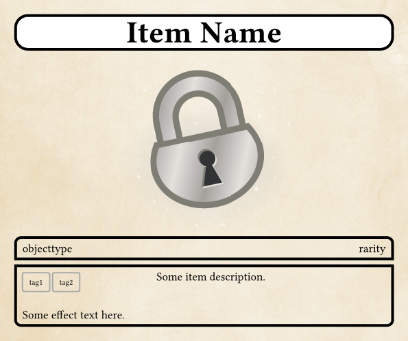

# Snuzzys-Itemcardmaker
A simple tool to generate itemcards for Pen and Paper or similar games from json files. Uses Typst for formatting and a small shell script for batchmaking. 

Needs to be run from files/

[[example.png]]
p align="center">
  

Currently only works on Linux distributions due to how paths are called.

Running cardbuilder.sh will compile any not up to date items from "files/items/". If no directories have been created the script will create them for the user. Items will only be rendered if their json file is newer than the rendered card, or if no image has been rendered yet. 

"cards" will contain json files containing the cards information. An example and template is provided as "example.json."

"images" will contain icons for the cards. Currently only .svg and .png have been tested but other datatypse should also work.

"items" will contain any rendered cards as pngs. If the user wants a pdf or different format this can be changed in "cardbuilder.sh" by changing the output variable. The name of the .json needs to be the same as its rendered image. Because of that duplicate names are not possible and cards and their render are linked by their file name.
